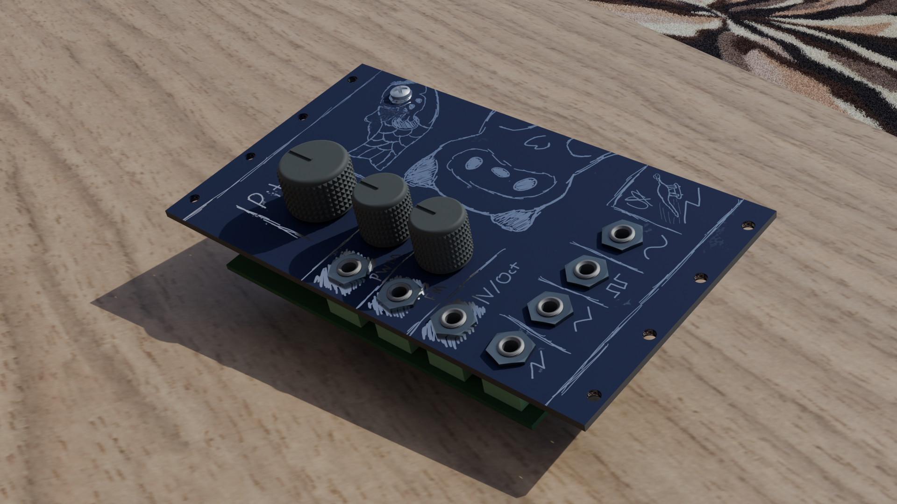
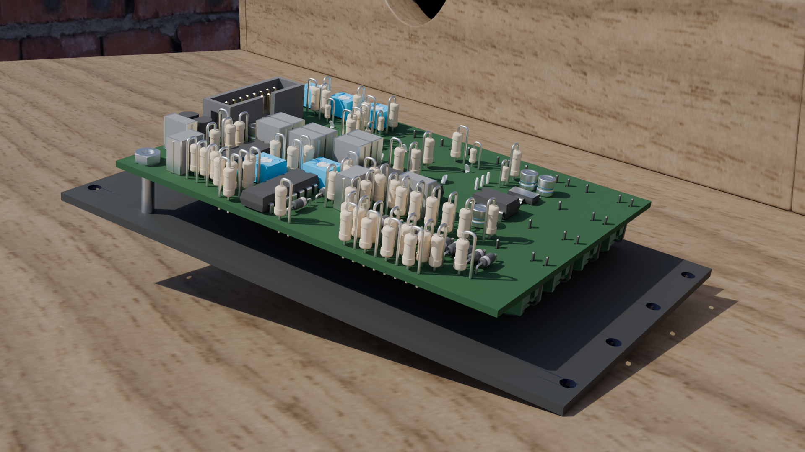

# VCO

_DIY VCO Eurorack module with saw, triangle, square, and sine output._

#### What?
This is a minimal, hand soldered, sawtooth core VCO module I designed to be inexpensive, fully analog, and with a variety of outputs. To that end, the module features sawtooth, triangle, pwm, and sine outputs, with pwm, fm, and pitch inputs. It internally features temparature tolerant circuitry, as well as having coarse and fine tuning, as well as pitch scale.

#### Why?
DIY eurorack modules are not particularly uncommon, but they often come at the cost of features. A lot of the time such modules lack functionality common to other prebuilt designs, and I wanted to change this. This module has a full standard feature set, including proper PWM and sine outputs.

Also, a lot of eurorack modules are quite bland in terms of design, often lacking any personality and focusing purely on cramming as many knobs in as possible. Here I've taken time to add some (imo) nice art and some extra space on the module.

#### How to use?
This should be pretty self explanatory:
- The pitch knob controls the pitch of the module. If using CV pitch, be sure to set this to the minimum.
- PWM input adjusts the width of the PWM output. The knob to the right of it controls the scale of the PWM CV.
- FM input modulates the frequency by the CV input. The knob controls the FM scale.
- Outputs are along the bottom!
Sawtooth, Triangle, PWM, and Sine, in that order.

#### Tuning
Hopefully, once you've received your pcb and soldered it up, it should look something like this:

Before you properly use it, you'll likely want to tune it.
This can be done by following these instructions:

1. Turn the `pitch` knob on the front of the board to the minimum.
2. Adjust the `coarse` trimpot on the back until the output is roughly A0 (~27.5Hz)
3. Adjust the `fine` trimpot to accurately tune the output.
4. Send 5V into the `1V/OCT` input on the front of the board.
5. Adjust the `scale` trimpot until your output is roughly A4 (~440Hz)
6. Repeat steps 2-5 several times until tuning is accurate at both A0 and A4.

Should the PWM output sound weird, just muck around with the `pwm` trimpot until it sounds normal.
Same thing with the sine or triangle output, just adjust the `tri off` trimpot.

#### Simulations
I've included the simulations I created on LTSpice; VCO contains the full circuit, PWM just the pwm section.

## Renders

## Zine Page

## BOM
_Needed is how many I personally need :)_
| Part                          | Quantity | Needed | Source     | Link                                                  | Lot / Min Amount | Unit  | Net   | Running |
|-------------------------------|----------|--------|------------|-------------------------------------------------------|------------------|-------|-------|---------|
| 10n Capacitor                 | 2        | 0      | LCSC       | https://www.lcsc.com/product-detail/C20415578.html    | 10               | NA    | NA    | $0.00   |
| 100n Capacitor                | 7        | 0      | LCSC       | https://www.lcsc.com/product-detail/C49002969.html    | 10               | NA    | NA    | $0.00   |
| 10u Capacitor                 | 4        | 0      | LCSC       | https://www.lcsc.com/product-detail/C49002971.html    | 5                | NA    | NA    | $0.00   |
| 22u Capacitor                 | 1        | 0      | LCSC       | https://www.lcsc.com/product-detail/C18214342.html    | 20               | NA    | NA    | $0.00   |
| 100k Resistor                 | 15       | 0      | LCSC       | https://www.lcsc.com/product-detail/C2843019.html     | 100              | NA    | NA    | $0.00   |
| 10k Resistor                  | 7        | 0      | LCSC       | https://www.lcsc.com/product-detail/C2903232.html     | 100              | NA    | NA    | $0.00   |
| 1k Resistor                   | 6        | 0      | LCSC       | https://www.lcsc.com/product-detail/C2903245.html     | 100              | NA    | NA    | $0.00   |
| 1M Resistor                   | 2        | 0      | LCSC       | https://www.lcsc.com/product-detail/C2903250.html     | 100              | NA    | NA    | $0.00   |
| 47k Resistor                  | 3        | 0      | LCSC       | https://www.lcsc.com/product-detail/C1364438.html     | 100              | NA    | NA    | $0.00   |
| 68k Resistor                  | 1        | 0      | LCSC       | https://www.lcsc.com/product-detail/C1364508.html     | 100              | NA    | NA    | $0.00   |
| 14k Resistor                  | 1        | 0      | LCSC       | https://www.lcsc.com/product-detail/C1369251.html     | 100              | NA    | NA    | $0.00   |
| 20k Resistor                  | 1        | 0      | LCSC       | https://www.lcsc.com/product-detail/C119353.html      | 100              | NA    | NA    | $0.00   |
| 200r Resistor                 | 1        | 0      | LCSC       | https://www.lcsc.com/product-detail/C714576.html      | 100              | NA    | NA    | $0.00   |
| 2k Resistor                   | 1        | 0      | LCSC       | https://www.lcsc.com/product-detail/C119330.html      | 100              | NA    | NA    | $0.00   |
| 100r Resistor                 | 2        | 0      | LCSC       | https://www.lcsc.com/product-detail/C1366145.html     | 100              | NA    | NA    | $0.00   |
| 33r Resistor                  | 2        | 0      | LCSC       | https://www.lcsc.com/product-detail/C713968.html      | 100              | NA    | NA    | $0.00   |
| 82r Resistor                  | 2        | 0      | LCSC       | https://www.lcsc.com/product-detail/C119302.html      | 100              | NA    | NA    | $0.00   |
| 470r Resistor                 | 1        | 0      | LCSC       | https://www.lcsc.com/product-detail/C129899.html      | 50               | NA    | NA    | $0.00   |
| 47r Resistor                  | 2        | 0      | LCSC       | https://www.lcsc.com/product-detail/C119296.html      | 50               | NA    | NA    | $0.00   |
| 330r Resistor                 | 1        | 0      | LCSC       | https://www.lcsc.com/product-detail/C713986.html      | 100              | NA    | NA    | $0.00   |
| 30r Resistor                  | 2        | 0      | LCSC       | https://www.lcsc.com/product-detail/C18724276.html    | 50               | NA    | NA    | $0.00   |
| 120r Resistor                 | 1        | 0      | LCSC       | https://www.lcsc.com/product-detail/C173141.html      | 50               | NA    | NA    | $0.00   |
| 39r Resistor                  | 2        | 0      | LCSC       | https://www.lcsc.com/product-detail/C119294.html      | 50               | NA    | NA    | $0.00   |
| 6.8k Resistor                 | 1        | 0      | LCSC       | https://www.lcsc.com/product-detail/C3397534.html     | 50               | NA    | NA    | $0.00   |
| BC557B                        | 1        | 0      | LCSC       | https://www.lcsc.com/product-detail/C512874.html      | 5                | NA    | NA    | $0.00   |
| BC547B                        | 1        | 0      | LCSC       | https://www.lcsc.com/product-detail/C900798.html      | 5                | NA    | NA    | $0.00   |
| Diode (1N4148)                | 15       | 15     | LCSC       | https://www.lcsc.com/product-detail/C402212.html      | 50               | $0.47 | $0.47 | $0.47   |
| 3362P 1k Trimpot              | 1        | 1      | LCSC       | https://www.lcsc.com/product-detail/C118947.html      | 5                | $0.72 | $0.72 | $1.19   |
| 3362P 10k Trimpot             | 1        | 1      | LCSC       | https://www.lcsc.com/product-detail/C118956.html      | 5                | $0.82 | $0.82 | $2.01   |
| 3362P 100k Trimpot            | 3        | 3      | LCSC       | https://www.lcsc.com/product-detail/C118966.html      | 5                | $0.77 | $0.77 | $2.78   |
| RK097 1M Vertical Pot         | 1        | 0      | Aliexpress | https://www.aliexpress.com/item/1005007278123055.html | 5                | NA    | NA    | $2.78   |
| RK097 100k Vertical Pot       | 2        | 0      | Aliexpress | https://www.aliexpress.com/item/1005007278123055.html | 5                | NA    | NA    | $2.78   |
| 10k NTC Thermistor            | 5        | 5      | LCSC       | https://www.lcsc.com/product-detail/C13879.html       | 10               | $0.44 | $0.44 | $3.22   |
| TL074                         | 3        | 3      | LCSC       | https://www.lcsc.com/product-detail/C133542.html      | 1                | $0.69 | $2.08 | $5.30   |
| AMS1117-2.5 SOT223            | 1        | 1      | LCSC       | https://www.lcsc.com/product-detail/C12087.html       | 5                | $0.26 | $1.29 | $6.59   |
| TC7660                        | 1        | 1      | LCSC       | https://www.lcsc.com/product-detail/C640848.html      | 1                | $1.90 | $1.90 | $8.49   |
| PJ301F Audio Jack             | 7        | 7      | Aliexpress | https://www.aliexpress.com/item/1005007344185064.html | 10               | $3.66 | $3.66 | $12.15  |
| 2x8 2.54mm IDC                | 1        | 1      | LCSC       | https://www.lcsc.com/product-detail/C7430313.html     | 5                | $0.08 | $0.42 | $12.57  |
| Aluminium Plate (100x200x2mm) | 1        | 1      | Aliexpress | www.aliexpress.com/item/1005007160296738.html         | 1                | $6.23 | $6.23 | $18.80  |
| M3x18mm Bolt                  | 1        | 0      | Aliexpress | https://www.aliexpress.com/item/32810852732.html      | 50               | NA    | NA    | $18.80  |
| M3 Hex Nut                    | 1        | 0      | Aliexpress | https://www.aliexpress.com/item/1005007593861199.html | 50               | NA    | NA    | $18.80  |

| Totals                          | Cost   |
|---------------------------------|--------|
| Aliexpress, Inc. Shipping + Tax | $12.67 |
| LCSC, Inc. Shipping + Tax       | $11.83 |
| Totals                          | $24.50 |

## CAD Links
Heres the links to the CAD source, Onshape:
[Panel source](https://cad.onshape.com/documents/2eb193865095ed64e7d8f18f/w/39a8bf3aab3e330703d68c10/e/c0b4bed9abee9891cf892ccc?renderMode=0&uiState=69e5a28fe43246e3fd53c583)

## Directory Structure
- **hardware/**
    - **bom/** - BOM Files (CSV and LibreOffice Calc)
    - **cad/** - CAD Files
        - **render/** - Files for rendering (inc. gltf models)
    - **ltspice/** - LTSpice electrical simulations
    - **vco/** - KiCad files
        - **lib/** - External libraries
        - **production/** - Production files (Gerber, etc.)
- **journals/**
- **zine/** - Zine page :)

## References
Circuit design influenced by:
[Moritz Klein DIY VCO Series](https://www.youtube.com/playlist?list=PLHeL0JWdJLvTuGCyC3qvx0RM39YvopVQN)
[Falstad Diode Clipper](https://www.falstad.com/circuit/e-diodeclip.html)
