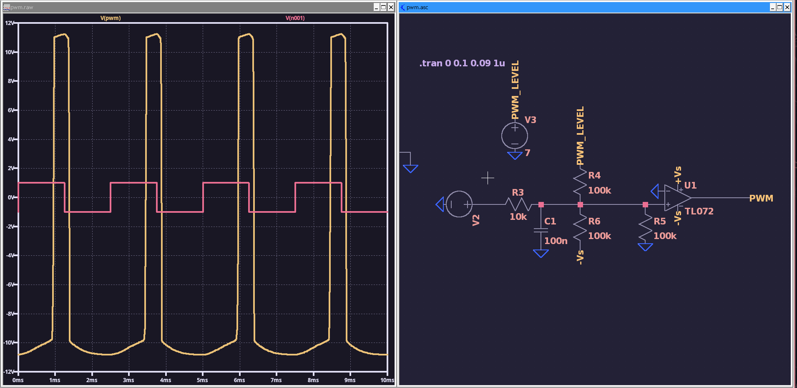

# VCO Journal 2 - 17/04/2026

Hello again! My internet was out for the earlier morning, but I've been doing some work on this offline and it's going super well :) I replaced the CV scaling and offset section to make it more usable IRL, with potentiometers instead of static resistors, and also added thermistors because some person on the internet said to \:)

A great side effect of this is it's actually working properly now; I've tuned it to A1 and after adjusting some timestep settings in LTSpice, it can happily go all the way up to 15kHz, equivalent of A9 which is a simply gargantuan range. If needed, it can also go lower, down to around 15Hz at the moment but by tweaking some resistor values I'm sure I could get it lower and make it into a proper LFO if needed.

Heres the new input section as of now:

At super low frequencies the triangle and sine wave get a bit distorted, but as soon as you're above ~100Hz it's fine, so I'm not particularly worried about that.

I have now met all of my compulsory design requirements, but its only been a couple days on this project total, and I feel like the pwm output is calling to me. 

I'm going to try and design a little pwm circuit with no references, and see how it turns out; potentially a bad idea but whatever it'll be fun :)

---

And here's what I've come up with:

It does work rather well, with the pwm level going from -6v to +6v (which could be scaled and offset easily) but there is a problem in that it only works at one frequency. This is because I used an RC filter to turn it into a sort of triangle wave, which changes amplitude at different frequencies.

<s>I'll have a look at how some actual smart people did it and see whats different.</s>
Nevermind I just realized that I can just use my triangle wave input lol.

Heres my final design, it works regardless of frequency, and has a CV input range of -5 to +5v, which is typical for eurorack. It does assume that the triangle is 10v p2p around gnd, which is also typical for eurorack and I can ensure this myself.

And integrating it into my actual design:

I also went through and made sure most of the outputs were scaled correctly, so all of them are ~10v p2p, and kinda half centered around ground.

It's not perfect but all modules have input decoupling anyways, so it shouldn't be a massive problem.

With that, I'm going to say this VCO design is done :)

Tomorrow, I'll start working on transferring it to kicad and getting the pcb sorted, but for now I've got a gig I need to get ready for; Tchuss!